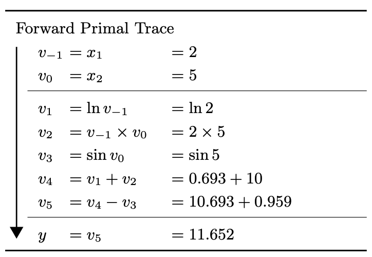
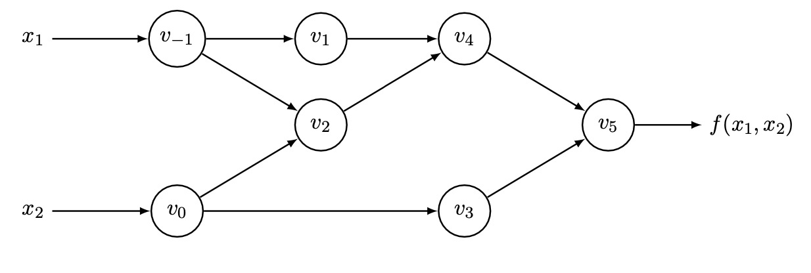
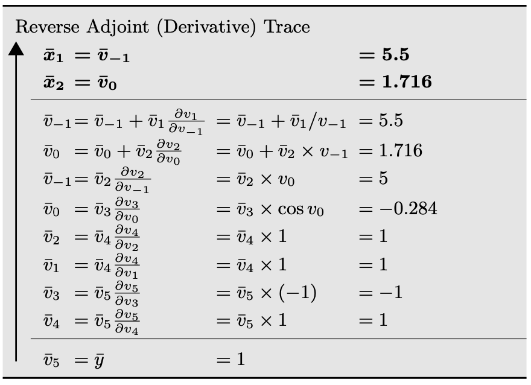

# 自动微分 Automatic Differentiation

## 引言

计算微分是机器学习领域的一项基本操作，许多机器学习中的传统方法都依赖于计算某个目标函数的梯度或黑塞矩阵$^{[2]}$。另一方面，随着神经网络模型的兴起，作为训练神经网络基础的反向传播算法（BP）也需要求目标函数对大量参数的微分。

在计算机程序中，微分的计算通常可以被分为 4 个类别：1）**手动微分**，并将解析式编写为程序；2）**数值微分**，使用近似算法；3）**符号微分**，使用计算机代数系统做表达式操作，例如 Mathematica 等程序；4）**自动微分（AD）**，也叫算法微分，是本文考察的主要部分。

在上世纪计算机发展早期，每当机器学习研究者提出一种新的模型，往往需要花费大量精力手动计算所需的微分，之后再将结果插入到标准的优化流程如 L-BFGS$^{[3]}$、随机梯度下降$^{[4]}$中。如今，随着神经网络不断加深，手动计算数以亿计的参数的微分是不现实的，并且难以应对日新月异的网络结构。另一方面，数值微分虽然可以利用程序大规模计算微分，但由于网络结构的复杂，误差的积累会不断加大，难以得到可用的结果。最后，使用诸如 `sympy` 库在表达式层面计算微分需要大量计算资源，同样难以应对深度学习大量参数、可变结构的要求。因此，自动微分因其可以应对大规模参数并且没有过多精度损失，同时可以自动应对网络结构变化，甚至可以处理诸如分支、循环等程序逻辑，在现代深度学习框架如 `Tensorflow`、`PyTorch` 中广泛使用。

## 自动微分$^{[1]}$

自动微分在程序上可以看作是一系列微分计算的结合。每一个自动微分计算都是一个基础运算的集合，这些基础运算例如加减乘除的微分是已知并且简单的。自动微分的工作是将这些简单基础运算的微分根据链式法则组合起来。



如上表所示，二元函数 $y=f(x_1,x_2)=\ln(x_1)+x_1x_2-\sin(x_2)$ 可以用基础运算的 *evaluation trace* 表示。令 $v_{i-n}=x_i, i=1,\dots,n$ 表示输入变量，$v_i, i=1,\dots,l$ 表示中间变量，$y_{m-i}=v_{l-i}, i=m-1,\dots,0$ 表示输出变量，则可以将此 evaluation trace 可视化为如下有向**计算图**。



计算图表达了一个函数的计算过程，便于应用链式法则。根据微分的计算方向，自动微分可以分为**前向模式（forward mode）**、**反向模式（reverse mode）**。前者在前向遍历计算图时，在每个结点都计算该结点关于输入变量 $x_i$ 的导数 $\frac{\part v_k}{\part x_i}$，最终计算至输出变量时即可得到 $\frac{\part y_j}{\part x_i}$，不难发现，前向模式可以在一次遍历中计算所有输出关于某个输入变量的导数。反向模式在前向遍历计算图时并不计算导数，而是保存相关信息，在遍历完成后，再进行一次反向遍历，其中根据链式法则计算 $\frac{\part y_j}{\part v_k}$，当遍历至输入变量时，即可得到 $\frac{\part y_j}{\part x_i}$，类似地，反向模式可以在一次反向遍历中，得到某个输出关于所有输入变量的导数。二者比较不难发现，对于函数 $f:\R^n\rightarrow\R^m$ 来说，当 $n \gg m$ 时，适合前向模式，当 $m \gg n$ 时，适合反向模式。



在神经网络中，通常情况下，我们要优化一个损失函数 $\mathcal{L}(\mathbf{x},\mathbf{\theta})$，其中 $\theta$ 是网络的所有参数，其维度显然远大于损失函数，因此BP 算法就是自动微分反向模式的一个实践。

尽管自动微分与 BP 算法十分契合，但它并非因 BP 发明，实际上，自动微分可以追溯到 1950 年代$^{[5,6]}$。前向模式作为一种计算偏微分的通用方法在 1964 年就被 Wengert 发现，但始终没有流行起来，知道 1980 年代现代编程语言和计算机的兴起将研究焦点重新带回自动微分算法$^{[7]}$。反向模式是与 BP 算法交替发展的。反向模式可以追溯到上世纪五六十年代，最早在控制理论研究者中被认可和传播，直到 1980 年 Speelpenning$^{[8]}$用通用程序语言实现了第一个反向自动微分算法。另一方面，在机器学习领域中，研究者们多次独立地提出 BP 算法，直到最近十几年二者合流，奠定了当前深度学习框架的基础。

## 实现

从上文中，我们可以看出，自动微分以来计算图的建立，在计算图建立以后反向遍历它就可以算出关于参数的微分。这里，我采用类似 `PyTorch` 的方式动态建图，即按照程序描述的计算方式自动地构建计算图，这种方式符合编程直觉、易于理解。

核心数据结构是 `Variable`，它主要包含的字段有： `value` 储存值；`require_grad` 标志是否需要计算梯度；`grad_fn` 是一个名为 `BackwardNode` 的数据结构，储存了计算图构建所需的信息。此外，对于 `Variable` 的运算，需要设计对应的 `Function`。这里 `Function` 设置为一个接口，其中 `forward` 和 `backward` 两个静态函数需要其子类的继承并实现，分别表达前向的数值计算逻辑和反向的梯度计算逻辑。例如 `_add` 类实现了一个 `Function`，表达了具有自动微分功能的 `Variable` 加法。

```python
class Function:
    @staticmethod
    def forward(ctx, *args):
        raise NotImplementedError

    @staticmethod
    def backward(ctx, grad_output):
        raise NotImplementedError
    
    @classmethod
    def apply(cls, *args):
        from .variable import Variable
        ctx = Contex()
        args_value = [arg.data() for arg in args]
        y = cls.forward(ctx, *args_value)

        y = Variable(y, require_grad=len([arg for arg in args if arg.require_grad]) > 0)
        if y.require_grad:
            y.grad_fn = BackwardNode(y, cls, ctx, args)
        return y

class _add(Function):
    @staticmethod
    def forward(ctx, x, y):
        z = x + y
        ctx.save_for_backward(x, y)
        return z

    @staticmethod
    def backward(ctx, grad_output):
        return grad_output, grad_output

def add(a, b):
    return _add.apply(a, b)
```

不难看出，`forward` 和 `backward` 只负责数值的计算，而自动微分计算图的关键在于 `Function::apply` 函数。正如 19 行所描述，它在计算数值运算的同时，为计算结果 `y` 设置了对应的 `grad_fn`，包含了该运算的名字、上下文、运算数，如此通过 `grad_fn` 可以构建出一个计算图。在图中，每个结点对应一个 `Variable`，这些结点可以是叶子或非叶子结点，通过 `Variable::is_leaf` 标识。遵循 `PyTorch` 的设计，当 `Variable` 设置不需 `required_grad` 或者是用户自己创建的变量，`Variable` 为叶子结点，意味着在反向计算梯度时不再需要继续向下遍历。

在计算图构建完成后，通过调用 `Variable::backward()` 即可遍历计算图，并计算该变量相对于参与其计算的所有中间变量的梯度。这里选择宽度优先遍历，这是因为当出现中间变量多次使用时，深度优先遍历会导致梯度的重复计算。

```python
def backward(self, gradient=None, retain_graph=False):
    if not self.is_leaf:
        self.grad = 1 if gradient is None else gradient
        # BFS
        queue = [self]
        while len(queue):
            v = queue.pop(0)
            # if this node is a leaf node, do not calculate gradients
            if v.is_leaf:
                continue
            v.grad_fn.backward(retain_graph=retain_graph)
            queue += [v for v in v.grad_fn.next_vars if v not in queue]
```

`example.py` 文件中实现了上文图示的例子 $y=f(x_1,x_2)=\ln(x_1)+x_1x_2-\sin(x_2)$，并实现了一个基于自动微分的梯度下降算法。


## 参考文献

1. Baydin, A. G., Pearlmutter, B. A., Radul, A. A., & Siskind, J. M. (2018). Automatic differentiation in machine learning: a survey. *Journal of Marchine Learning Research*, *18*, 1-43.
2. Suvrit Sra, Sebastian Nowozin, and Stephen J. Wright. Optimization for Machine Learning. MIT Press, 2011.
3. Ciyou Zhu, Richard H. Byrd, Peihuang Lu, and Jorge Nocedal. Algorithm 778: L-BFGS-B: Fortran subroutines for large-scale bound-constrained optimization. ACM Transactions on Mathematical Software (TOMS), 23(4):550–60, 1997. doi: 10.1145/279232.279236.
4. L ́eon Bottou. Online learning and stochastic approximations. On-Line Learning in Neural Networks, 17:9, 1998.
5. John F. Nolan. Analytical differentiation on a digital computer. Master’s thesis, Mas- sachusetts Institute of Technology, 1953.
6. L. M. Beda, L. N. Korolev, N. V. Sukkikh, and T. S. Frolova. Programs for automatic differentiation for the machine BESM (in Russian). Technical report, Institute for Precise Mechanics and Computation Techniques, Academy of Science, Moscow, USSR, 1959.
7. Andreas Griewank. On automatic differentiation. In M. Iri and K. Tanabe, editors, Math- ematical Programming: Recent Developments and Applications, pages 83–108. Kluwer Academic Publishers, 1989.
8. Bert Speelpenning. Compiling Fast Partial Derivatives of Functions Given by Algo- rithms. PhD thesis, Department of Computer Science, University of Illinois at Urbana- Champaign, 1980.
